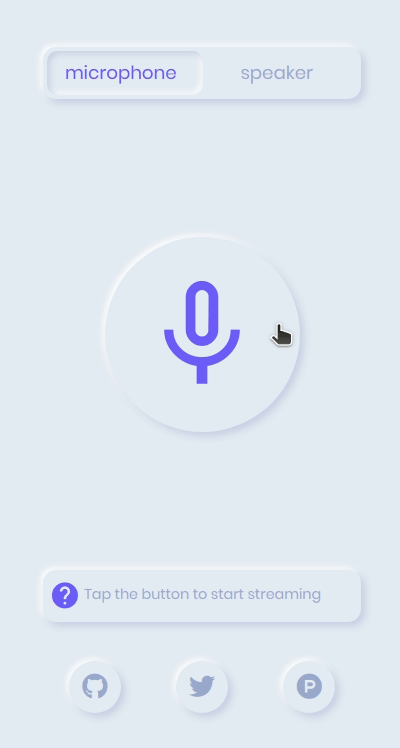

  
  <h3><a href="https://webmic.suda.pl/" target="_blank">Web Microphone</a></h3>
  <h6>Turn any device into a wireless microphone</h6>
  
  
  

## 🎙 What is this?

<a href="https://webmic.suda.pl/" target="_blank">Web Microphone</a> is a small web app that allows you to stream your microphone to another browser with very small latency and decent quality.
It's a great tool when you need a wireless microphone for streaming or just want to monitor another room.

## 🔊 How does it work?

Once you open it on the device you want to use as a microphone, click/tap the big **microphone button** and the app will start looking for another app that is set to be "a speaker".

Then you can the app on another device/browser/tab, select **speaker** and then click/tap the big **speaker button**. The two apps will try to find each other and once they do, the status below the button will say:

> Streaming to **Browser(OS)**

or

> Listening from **Browser(OS)**

to confirm that both apps are connected to each other. Of course **Browser** will be the name of the web browser and **OS** the operating system of the microphone/speaker.

## 👂 Is it safe? Can anyone listen to my microphone? Are you recording anything?

Yes/No/NO!

Communication between the microphone and speaker is encrypted and goes straight from device to device, without any servers in between, so there's no way to record it or listen in on the conversation.

That being said, currently the way the microphone finds the speaker and vice versa is quite simple and in case of many users at once, it could connect to the wrong microphone/speaker. This is by design to make it very simple and not to require any codes, passwords etc. but might need to change in the future. For now I recommend making sure if you're connected to the mic/speaker that you wanted and if not, try connecting again.

## 👩‍💻 How does it work under the hood?

There are two main parts in play here:
* [WebRTC](https://webrtc.org/) that takes care of connecting the peers and handling the audio stream
* [IPFS PubSub](https://blog.ipfs.io/25-pubsub/) that acts as the signaling/discovery server to allow the mic and speaker find each other and negotiate connection

Go ahead and explore [the source](script.js) to see how it works.

The UI is done using [Alpine.js](https://github.com/alpinejs/alpine) a lightweight library, great for small prototypes.

## 🙇 Credits

* 🎨 [Maria Muñoz](https://dribbble.com/myacode) for the amazing Neumorphic Components design and code
* 📚 [Chad Retz](https://github.com/cretz/webrtc-ipfs-signaling) for PoC of using IPFS PubSub as a signaling server